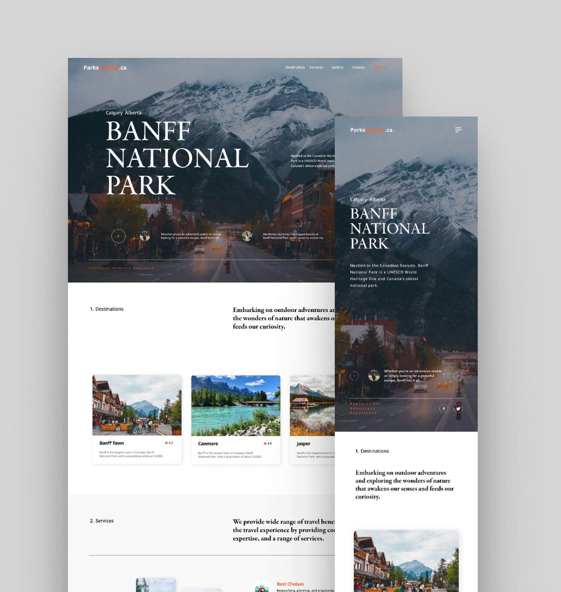

# Travel Landing page | web design

 

Welcome to the Travel Landing Page for Banff National Park. This web design project showcases the stunning beauty of Banff through an immersive and visually appealing landing page.

## Technologies Used
- **Html**
- **Css**
- **Javascript**

## Try It Out 
To see the page, visit [Frankie Portfolio](https://parkcanada.netlify.app/). 

## Getting Started 
1. Clone this repository: `git clone https://github.com/your-username/your-repo.git`
2. Install the required dependencies: `npm install`
3. Run the app locally: `npm start`

## Color Reference 
| Color           | Hex      |
| --------------- | -------- |
| Orange          |  #F86729  |
| Grey            | #C5C5C5  |
| white           | #ffffff  |

Feel free to explore and contribute to this project. If you have any suggestions or find issues, please create a GitHub issue.

